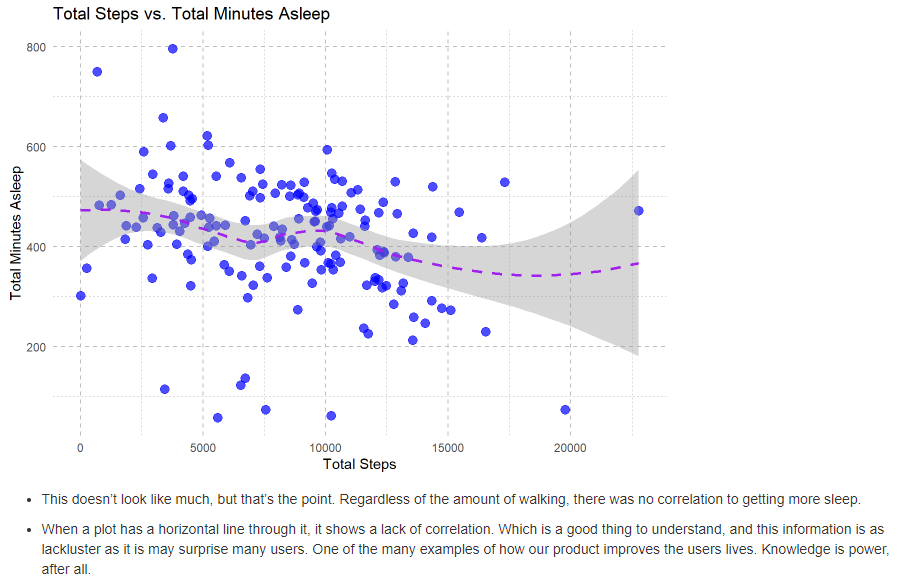

# Erik Gonzalez - Portfolio

* [Linked-In](https://www.linkedin.com/in/gonzalez-erik/)
* [GitHub](https://github.com/Lummsx)
* [Email](lummsx@gmail.com)

## Analytics Portfolio

# [Project 1: Bellabeat Data Analysis - How can a wellness company play it smart?](https://github.com/Lummsx/EG-Capstone-Project)

This is a project I completed during my time with Merit America through the Data Analytics program from Google.

* The dataset was provided from Kaggle, recording the data of thirty-three Fitbit users.
* The model uses both; data cleaning techniques, and mid-level visualization techniques.
* Provided analysis for average hours slept, and as well as average total steps that were compared with recommendations from the Mayo Clinic.
* Suggested additional marketing strategies to further enchance user experience, and as well as methods for further data gathering for more concrete and detailed analysis in the future.

## Overview Of Total Steps vs. Total Minutes Asleep

